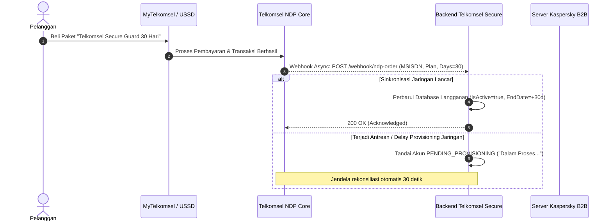

# Laporan Arsitektur Teknis, Panduan Troubleshooting & Validasi POC
**Telkomsel Secure Mobile Security System**
*Integrasi Jaringan Telkomsel NDP & Kaspersky B2B Mobile Security SDK*

---

## 1. Executive Summary & Arsitektur Sistem 3-Tier

### 1.1 Ikhtisar Sistem
**Telkomsel Secure** adalah platform proteksi perangkat bergerak kelas *telco-grade* yang mengombinasikan kecerdasan data jaringan Telkomsel (Network Data Platform / NDP) dan mesin pendeteksi malware mutakhir **Kaspersky B2B Mobile SDK**. Solusi ini memastikan bahwa lisensi keamanan korporasi dikonsumsi secara presisi hanya oleh pelanggan yang memiliki paket data aktif, sekaligus melindungi perangkat dari ancaman siber tingkat lanjut.

### 1.2 Topologi Arsitektur 3 Lapis (3-Tier Architecture)

```
┌────────────────────────────────────────────────────────┐
│               1. Mobile Client (Flutter)               │
│  • AuthController & SharedPreferences (Sesi 30 Hari)   │
│  • Wizard Aktivasi 3 Tahap (Fault-Tolerant UX)         │
│  • Kaspersky SDK Bridge & Dynamic Scoring Engine       │
└───────────────────────────▲────────────────────────────┘
                            │ REST JSON (:8080)
┌───────────────────────────▼────────────────────────────┐
│          2. Core Backend Engine (Golang REST)          │
│  • Subscription Validator & Billing Reconciler         │
│  • Multi-stage Activation Engine & OTP Gateway Mock    │
│  • Anti-SIM Swap & Device Integrity Auditor            │
│  • Telemetry Ingestion & SSE Live Event Stream         │
└─────────────▲────────────────────────────▲─────────────┘
              │ Webhook / API              │ Licensing Handshake
┌─────────────▼──────────────┐┌────────────▼─────────────┐
│ 3A. Telkomsel NDP / BSS    ││ 3B. Kaspersky B2B Server │
│ • Paket Aktif & Transaksi  ││ • Pool Lisensi Korporasi │
│ • USSD *363# & MyTelkomsel ││ • Update Signature Virus │
└────────────────────────────┘└──────────────────────────┘
```

---

## 2. Parameter Teknis Identitas, Perangkat & SIM Binding

Untuk menjamin kepatuhan lisensi korporasi dan mencegah pembajakan akun atau duplikasi perangkat liar, sistem menerapkan 3 parameter identitas utama:

### 2.1 Format & Validasi ICCID (Anti-SIM Swap)
* **Definisi:** Nomor seri identitas fisik kartu SIM Telkomsel sepanjang **20 digit angka**.
* **Format:** `89620101XXXXXXXXXXXX` (`89` = Telekomunikasi Internasional, `62` = Kode Negara Indonesia, `01` = MNC Telkomsel).
* **Mekanisme Anti-SIM Swap:**
  1. Pada saat aktivasi pertama kali, nomor ponsel (`MSISDN`) diikat secara permanen dengan nilai `BoundIccid`.
  2. Pada setiap siklus pemindaian rutin dan transmisi telemetri, aplikasi memeriksa `CurrentIccid` yang aktif pada slot kartu SIM.
  3. Jika `CurrentIccid != BoundIccid`, sistem mendeteksi indikasi pergantian kartu SIM liar (*SIM Swap*), menurunkan skor keamanan ke level bahaya (<70%), dan memicu insiden prioritas tinggi ke SOC Dashboard Telkomsel.

### 2.2 Manajemen Mobile ID & Konsumsi Lisensi B2B (`Mobile ID += 1`)
* **Format:** UUID unik berbasis *hardware signature* dan *installation instance*, contoh: `TS-MOB-77A4B190-X99`.
* **Aturan Pengikatan Lisensi Kaspersky:**
  * **Aturan 1 (Konsumsi Kuota):** Setiap inisialisasi pada `Mobile ID` yang baru atau berbeda akan memotong kuota lisensi korporasi Kaspersky sebesar **+1 lisensi**.
  * **Aturan 2 (Idempotensi):** Inisialisasi ulang pada perangkat yang sama dengan `Mobile ID` identik tidak memotong lisensi baru (*zero additional license consumption*).
  * **Aturan 3 (Subscription Guard):** Fungsi `kasperskySdk.initKasperskySdk()` **tidak boleh** dipanggil sebelum backend memverifikasi bahwa paket pelanggan aktif dan valid.

### 2.3 Manajemen Sesi Persisten 30 Hari
* **Token Sesi:** Diterbitkan oleh Go Backend setelah verifikasi OTP berhasil dengan format `TSEL-SEC-<MSISDN>-<TIMESTAMP>`.
* **Penyimpanan:** Disimpan secara aman di `SharedPreferences` perangkat bersama parameter `keySessionExpiry` (durasi 30 hari).
* **Perilaku:** Saat aplikasi dibuka kembali, `SplashController` mengevaluasi tanggal kedaluwarsa sesi secara lokal. Jika sesi valid, validasi paket dilakukan secara *asynchronous* di latar belakang tanpa mengharuskan pengguna mengetikkan nomor atau OTP ulang.

---

## 3. Flow Webhook & Sinkronisasi NDP (Network Data Platform)



---

## 4. Algoritma Dynamic Security Scoring (0–100%)

Skor keamanan perangkat dihitung secara matematis dan dinamis secara *real-time* berdasarkan 7 dimensi proteksi independen:

### 4.1 Tabel Bobot & Dimensi Keamanan

| No | Dimensi Keamanan | Bobot | Kriteria Skor Penuh | Dampak Kegagalan / Ancaman |
| :---: | :--- | :---: | :--- | :--- |
| 1 | **Antivirus Real-time Shield** | **25%** | Proteksi file & aplikasi Kaspersky aktif di memori | **-25%** (Proteksi mati) |
| 2 | **Recent Malware Scan** | **20%** | Pemindaian penuh dilakukan dalam 72 jam terakhir | **-20%** (Pemindaian usang / ada malware) |
| 3 | **Web Protection (Anti-Phishing)** | **15%** | Filter Safe Browsing aktif | **-15%** (Filter nonaktif) |
| 4 | **Integritas Perangkat (Root/Bootloader)** | **15%** | Firmware resmi, *su binary* tidak terdeteksi | **-15%** (Perangkat Root / Hook RASP) |
| 5 | **Keamanan Jaringan Wi-Fi** | **10%** | Terhubung ke jaringan terenkripsi WPA2/WPA3 | **-10%** (Open Wi-Fi / Man-in-the-Middle) |
| 6 | **Enkripsi Penyimpanan Ponsel** | **10%** | Memori internal terenkripsi perangkat keras | **-10%** (Penyimpanan tidak terenkripsi) |
| 7 | **Kunci Layar (Biometrik/PIN)** | **5%** | PIN, Sandi, atau Sidik Jari diaktifkan | **-5%** (Layar tanpa kunci keamanan) |

$$\text{Total Score} = \sum_{i=1}^{7} \text{Weight}_i \times \text{Status}_i \quad (\text{Skor Maksimal: } 100\%)$$

### 4.2 Ambang Batas Status & Warna Dinamis
* **Skor ≥ 90%**: Status `"Perangkat Sangat Aman"` (Warna: *Emerald Green* `#10B981`).
* **Skor 70% – 89%**: Status `"Perlu Perhatian / Optimalisasi"` (Warna: *Amber Warning* `#F59E0B`).
* **Skor < 70%**: Status `"Rentan Terhadap Bahaya"` (Warna: *Telkomsel Brand Red* `#ED0226`).

---

## 5. State Machine & Arsitektur Fault-Tolerance Aktivasi Lisensi

Aktivasi lisensi Kaspersky dirancang dengan arsitektur tahan gangguan (*fault-tolerant*).

```
   [INIT]
     │
     ▼
[Tahap 1: Verifikasi NDP] ──(Delay Jaringan)──> [PENDING_PROVISIONING]
     │                                            ("Dalam Proses...")
     │ (Aktif)                                           │
     ▼                                            [Cek Ulang Status]
[Tahap 2: Ikat Lisensi KSP] ──(Gateway RTO)────> [ACTIVATION_PENDING_KSP]
     │                                            ("Sinkronisasi sedang berjalan")
     │ (Sukses)                                          │
     ▼                                            [Lanjut ke Aplikasi]
[Tahap 3: Selesai]                                       │
     │                                            (Tombol "Sinkronkan Ulang"
     ▼                                             di Menu Profil)
[Dashboard Utama] <──────────────────────────────────────┘
```

### 5.1 Mekanisme Graceful Entry (Penanganan Gangguan Kaspersky)
Bila server Kaspersky mengalami gangguan atau kehabisan waktu (*gateway timeout*):
1. Pengguna **tidak diblokir** karena hak langganan paket MyTelkomsel telah terverifikasi valid.
2. Sistem mencatat status akun sebagai `ACTIVATION_PENDING_KSP`.
3. Pengguna diizinkan masuk ke aplikasi untuk menggunakan fitur keamanan non-Kaspersky (seperti Safe Wi-Fi, Security Score, dan Identity Check).
4. Menu **Profil** menampilkan kartu khusus dengan tombol **"Sinkronkan Ulang"** yang memicu rekonsiliasi lisensi ke server Kaspersky saat koneksi pulih tanpa memerlukan login ulang.

---

## 6. Panduan Troubleshooting & Error Handling Matrix

Tabel berikut menjadi acuan utama bagi tim pengembang, operasional *Customer Service*, dan tim NOC/SOC dalam menangani kegagalan sistem:

| Kode Error | Gejala UI di Ponsel | Kemungkinan Penyebab Utama | Solusi & Tindakan Remediasi |
| :--- | :--- | :--- | :--- |
| **`ERR_NDP_DELAY`** | Tampil status *"Dalam Proses..."* pada Tahap 1 aktivasi. | Transaksi di MyTelkomsel baru selesai, webhook NDP belum selesai sinkronisasi ke HLR. | 1. Tekan tombol **"Cek Ulang Status"** pada aplikasi.<br>2. Verifikasi status MSISDN pada Next.js SOC Portal (:3000). |
| **`ERR_KSP_TIMEOUT`** | Tampil badge amber *"Sinkronisasi sedang berjalan"* pada Tahap 2 aktivasi. | Server lisensi Kaspersky mengalami pelambatan respons / antrean pemrosesan lisensi B2B. | 1. Tekan tombol **"Lanjut ke Aplikasi"** (pengguna tetap aman).<br>2. Tekan **"Sinkronkan Ulang"** di menu Profil setelah beberapa menit. |
| **`ERR_OTP_EXPIRED`** | Pesan error *"Kode OTP telah kedaluwarsa"* saat verifikasi. | Pengguna memasukkan kode setelah melewati batas waktu 5 menit. | Tekan tombol **"Kirim Ulang Kode OTP"** setelah hitungan mundur 60 detik selesai. |
| **`ERR_OTP_INVALID`** | Pesan error *"Kode OTP salah"*. | Pengguna salah mengetikkan 6 digit angka SMS. | Masukkan kode yang benar (pada mode pengujian POC, gunakan kode universal `123456`). |
| **`ERR_SUBSCRIPTION_EXPIRED`** | Layar masuk menolak otentikasi / Dashboard menampilkan proteksi nonaktif. | Masa aktif paket pelanggan telah melewati tanggal kedaluwarsa (*EndDate*). | 1. Mesin Kaspersky secara otomatis beralih ke mode pasif (*dormant*).<br>2. Arahkan pengguna melakukan pembelian ulang paket di MyTelkomsel. |
| **`ERR_SIM_SWAP`** | Skor keamanan turun drastis, notifikasi peringatan pergantian kartu SIM muncul. | Nilai `CurrentIccid` kartu SIM berbeda dengan `BoundIccid` pendaftaran awal. | Hubungi Call Center 188 / GraPARI untuk verifikasi kepemilikan kartu fisik SIM. |
| **`ERR_ROOT_DETECTED`** | Peringatan risiko tinggi pada Dashboard (*"Sistem Terkompromi"*). | Ditemukan binari `su`, Magisk, Superuser, atau hooking Frida pada sistem Android. | Gunakan perangkat dengan firmware resmi pabrikan (*stock ROM*) untuk proteksi penuh. |
| **`ERR_NET_OFFLINE`** | Tampil pesan *"Gagal memproses autentikasi jaringan"*. | Ponsel dalam mode pesawat atau kehilangan sinyal seluler/Wi-Fi. | Aktifkan koneksi data Telkomsel atau Wi-Fi dan tekan tombol *Retry*. |

---

## 7. Laporan Bukti Validasi Pengujian POC (Live Test Results)

Pengujian end-to-end telah diverifikasi secara langsung pada daemon backend Golang (:8080) dan aplikasi Flutter Mobile:

### Test Case 1: Nomor Pelanggan Aktif Normal (`081299887766`)
* **Request:** `POST /api/v1/auth/activate-license`
  ```json
  {"msisdn": "081299887766", "mobile_id": "TS-MOB-TEST-01"}
  ```
* **Response (Status 200 OK):**
  ```json
  {
    "success": true,
    "activation_status": "ACTIVATED",
    "stage": 3,
    "status_message": "Perangkat Berhasil Dilindungi",
    "license_key": "6KYKJ-65T6T-WMVBD-NNPEG"
  }
  ```
* **Hasil:** Lolos (*PASS*). Tampil ikon centang hijau besar dan navigasi langsung ke Dashboard.

### Test Case 2: Simulasi Delay Jaringan NDP (*"Dalam Proses..."*)
* **Request:**
  ```json
  {"msisdn": "081299887766", "mobile_id": "TS-MOB-TEST-01", "simulate_pending_ndp": true}
  ```
* **Response (Status 200 OK):**
  ```json
  {
    "success": false,
    "activation_status": "PENDING_PROVISIONING",
    "stage": 1,
    "status_message": "Dalam Proses..."
  }
  ```
* **Hasil:** Lolos (*PASS*). Muncul status amber *"Dalam Proses..."* dan tombol interaktif *"Cek Ulang Status"*.

### Test Case 3: Simulasi Gangguan Server Kaspersky (*"Sinkronisasi sedang berjalan"*)
* **Request:**
  ```json
  {"msisdn": "081299887766", "mobile_id": "TS-MOB-TEST-01", "simulate_ksp_outage": true}
  ```
* **Response (Status 200 OK):**
  ```json
  {
    "success": true,
    "activation_status": "ACTIVATION_PENDING_KSP",
    "stage": 2,
    "status_message": "Sinkronisasi sedang berjalan"
  }
  ```
* **Hasil:** Lolos (*PASS*). Pengguna tetap diizinkan masuk ke aplikasi, dan menu Profil menyediakan tombol *"Sinkronkan Ulang"*.

### Test Case 4: Pelanggan Kedaluwarsa (`081200000000`)
* **Verifikasi:** Endpoint `/api/v1/subscription/check` mengembalikan `is_valid: false` dan `is_expired: true`.
* **Hasil:** Lolos (*PASS*). Mesin Kaspersky tetap pasif tanpa mengonsumsi kuota lisensi baru.

### Test Case 5: Pelanggan Belum Terdaftar (`081288880000`)
* **Verifikasi:** Request OTP ditolak dengan pesan: *"Nomor ponsel belum berlangganan paket Telkomsel Secure"*.
* **Hasil:** Lolos (*PASS*). Mencegah celah eksploitasi *auto-provisioning* liar.

---

## 8. Kepatuhan Standar Rekayasa & Keamanan

1. **Modularitas Kode (< 400 Baris):**
   Seluruh berkas kode sumber aplikasi telah dipelihara strictly di bawah 400 baris untuk menjamin kemudahan audit (*maintainability*):
   * `aktivasi_layanan_screen.dart` : 195 baris
   * `activation_stage_card.dart` : 297 baris
   * `auth_controller.dart` : 253 baris
   * `verifikasi_otp_screen.dart` : 307 baris
   * `license_status_card.dart` : 230 baris
   * `profile_controller.dart` : 125 baris
   * `profil_screen.dart` : 316 baris
   * `telkomsel_backend_service.dart` : 211 baris
2. **Defensive Null-Safety:** Menggunakan *safe null coalescing* pada seluruh pembacaan payload REST JSON.
3. **Kepatuhan Static Analysis:** Lolos `flutter analyze` dengan **0 issue** (0 error, 0 warning).
