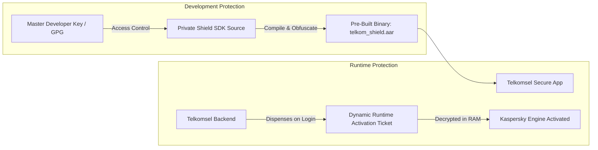
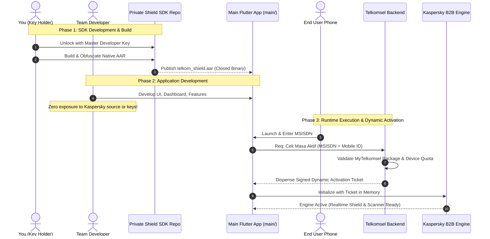

# Telkomsel Secure Shield SDK Architecture & Key Governance

## Executive Summary
This document establishes the strategic architectural design for decoupling the proprietary **Telkomsel Security Core & Kaspersky B2B Engine** into a dedicated **Shield SDK**. 

This pattern resolves two fundamental concerns:
1. **Intellectual Property & Anti-Reverse Engineering**: Preventing third-party actors and unauthorized developers from decompiling, inspecting, or extracting the core Kaspersky SDK and IPC channels.
2. **Team Maintainability (Bus Factor Mitigation)**: Allowing general developers to build, test, and improve the Flutter application without having access to sensitive source code or proprietary license credentials.

---

## 1. Core Architectural Pillars

### Pillar 1: Dual-Key Governance Model

1. **Development-Time Master Key (Source Lock)**:
   - Held exclusively by you (and designated trusted architects).
   - Restricts access to the native Kaspersky bridge, MethodChannel implementations (`com.taspenguard/ksp`), and C++ bindings.
   - General developers receive only a pre-compiled, symbol-stripped binary (`.aar` / pre-built package).
2. **Runtime Dynamic Ticket (Zero Trust Activation)**:
   - Solves the DRM paradox (preventing keys from being hardcoded in public APKs).
   - The app cannot run or unlock the Kaspersky engine on a device without a short-lived, digitally signed activation ticket issued by `Backend Telkomsel Secure` after validating the customer's active subscription in MyTelkomsel.

---

## 2. End-to-End System Workflow

---

## 3. Comparison of Implementation Paths

| Evaluation Metric | Path A: Monolithic App Hardening | Path B: Decoupled Binary Shield SDK (Recommended) | Path C: Cloud-Based Shielding (Seciron / DexGuard) |
| :--- | :--- | :--- | :--- |
| **IP Protection** | Low-Medium (Cleartext code visible in team repo) | **High** (Core code strictly locked in private binary) | Very High (Enterprise post-compilation VMP) |
| **Team Maintainability** | High, but exposes all secrets | **High** (Clean separation of concerns, Bus factor safe) | Moderate (Requires third-party CLI integration) |
| **Cost** | $0 | **$0** (In-house standard Gradle/Flutter tooling) | High ($$$ enterprise recurring license) |
| **Reverse Engineering Barrier** | Casual attackers delayed | **Substantial** (No cleartext symbols or SDK source) | Maximum (Hardened native unpacker) |
| **Upgrade Sustainability** | High | **High** (Native Android/Flutter standards) | Dependent on vendor compatibility updates |

---

## 4. Associated Diagram Files
- A Draw.io workflow chart is stored at: [`doc/architecture/shield_sdk_workflow.drawio`](file:///d:/DEVELOPMENT/Projects/Riski/TelkomSecure/doc/architecture/shield_sdk_workflow.drawio).
- You can open this file in VS Code (with the Draw.io extension) or via [app.diagrams.net](https://app.diagrams.net).
