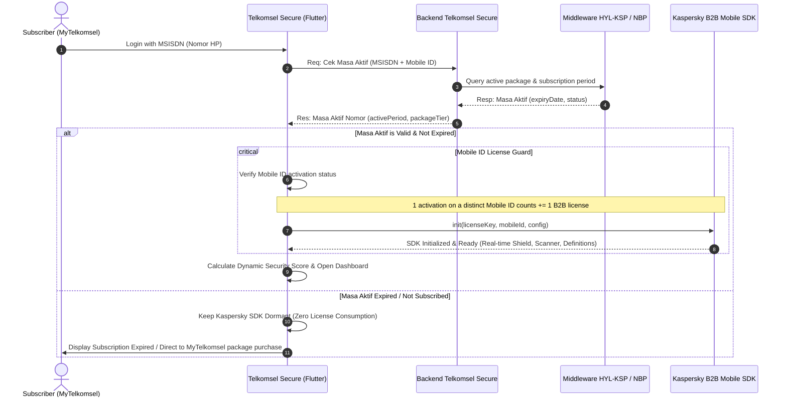

# Telkomsel Secure Architecture & Workflow

## Overview
Telkomsel Secure Mobile Security is an anti-virus and threat management client powered by the **Kaspersky B2B Mobile SDK**. It integrates with the Telkomsel backend and billing ecosystem to validate customer active subscription periods before initializing security engine licenses.

---

## System Architecture & Interaction Flow
*(Based on the blueprint documented in `Workflow.jpeg`)*

---

## Kaspersky B2B Mobile SDK Licensing Rules
1. **Per-Device Licensing (`Mobile ID += 1`)**:
   - Every activation bound to a unique `Mobile ID` permanently consumes/bills **+1 Kaspersky B2B license**.
   - Repeated initializations on the *same* verified device must reuse cached session credentials without issuing new activation handshakes.
2. **Pre-requisite Validation**:
   - The application **must never** invoke `Kaspersky.init()` blindly on app launch.
   - The SDK is strictly initialized **only after** `activePeriod` is verified as active and valid from `Backend Telkomsel Secure`.
3. **Graceful Deactivation**:
   - If the active period expires, the client transitions the local security engine to passive mode without triggering SDK re-activation.
